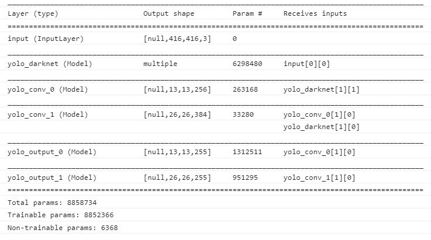

# YOLOv3 Tiny implementation using TensorflowJs

### Demo
https://aeggarut.github.io/TensorFlowJS-YOLOv3Tiny-ObjectDetection/

### Introduction
This repository provide basic concept to implement object detection model like **YOLOv3** on browser using **TensorFlowJS**.
#### Why you need to learn from this repository?
Since **TensorflowJS (JavaScript)** doesn't provide all neccessary functions that are required to convert from prediction's output which are numeric values to  image with bouding boxes and labels as shown in below image.
 
  Sample image is obtained from https://cocodataset.org
 So some functions need to be manually built in JavaScript such as following functions.
<ol>
<li> Image normalization.</li>
<li> Coordinate conversion. To convert from bX, bY, bH, bW to Xmin, Ymin, Xmax, Ymax.</li>
<li> Image drawing. To draw bouding boxes and labels on image.</li>
</ol>
This repository teach basic understanding to implement above functions in single html file. (index.html)

### Prerequisite knowledge
<ol>
<li>Simple model implementation using TensorFlow.</li>
<li>Basic understanding of layer's functions, CONV2D, BatchNormalization, MaxPool2D, UpSampling2D.</li>
<li>How YOLO work, If you don't know it, kindly learn from this course: https://www.coursera.org/learn/convolutional-neural-networks/home/week/3</li>
</ol>

### Folder structure
1. **index.html** contains all important functions including model loading, image loading, image normalization, inference, coordinate conversion, Non-Max Suppression (NMS), and drawing output image.
2. **light.jpg** is sample image which you can change to another image by yourself.
3. **folder /model** contains YOLOv3Tiny model structure and weights. All files in this folder are outcome of exported **TensorFlow keras'** model using command:
<code>tensorflowjs_converter --input_format=input_model_name.h5 output_model_name</code> 
Before you can use above command you need to install TensorFlowJS using this command: <code>pip install tensorflowjs</code>

### Why YOLOv3 (Tiny) not YOLOv3
Since YOLOv3 (Tiny) has less complicate structure than YOLOv3, number of weights (model parameters) is less than YOLOv3's. Ofcourse, size of model is reduced from 240+ MB to 30+ MB which is suitable to run on web browser.

### YOLOv3 Tiny structure
To see model structure, 
1. Go to https://aeggarut.github.io/TensorFlowJS-YOLOv3Tiny-ObjectDetection/ 
2. Click Detect object button
3. Press CTRL+SHirt+J to open developer console (Chrome)
4. You will see model structure as shown in below image

### Implementation flow
<ol>
<li>Load model using  
<code>const MODEL_URL='https://aeggarut.github.io/TensorFlowJS-YOLOv3Tiny-ObjectDetection/model/model.json';
            const model=await tf.loadLayersModel(MODEL_URL);</code>
</li>

 
<li>Load image using  
<code>rawImage = document.getElementById('canvasimg');
            var raw = tf.browser.fromPixels(rawImage,3);</code>
  
</li>

 
<li>Resize & normalize image using  
<code>var resized = tf.image.resizeBilinear(raw, [416,416]);
            resized=resized.div(255);</code>
</li>

 
<li>Inference using 
<code>var prediction = model.predict(tensor);</code>
</li>

 
<li> Reshape prediction output from two layers:  
yolo_output_0 with shape (1, 13, 13, 255) 
yolo_output_0 with shape (1, 26, 26, 255)
using  
<code>var prediction1=prediction[0].reshape([1,13,13,3,85]);
            var prediction2=prediction[1].reshape([1,26,26,3,85]);</code>
</li>

 
<li> Convert coordinate values using function: **yolo_boxes()**  
<code>To convert from bX, bY, bH, bW to Xmin, Ymin, Xmax, Ymax.</code>
</li>

 
<li> Remove duplicated boxes using function:** yolo_nms()**  
<code>yolo_nms() applies tf.image.nonMaxSuppressionWithScore() which returns index of chosen boxes</code>
</li>

 
<li> Draw image using function: **drawOutput()**  
<code>Convert relative coordinates [0-1] to real coordinates of image then draw boounding box and label on image using html canvas</code>
</li>
</ol>

### Credit
I learn YOLOv3 and YOLOv3 Tiny implementation in Python using TensorFlow from this repoitory: https://github.com/zzh8829/yolov3-tf2

