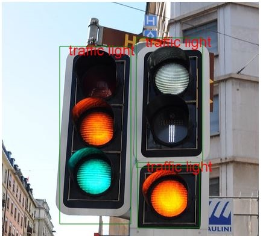

#YOLOv3 Tiny implementation using TensorflowJs

### Demo
https://aeggarut.github.io/TensorFlowJS-YOLOv3Tiny-ObjectDetection/

### Introduction
This repository provide basic concept to implement object detection model like **YOLOv3** on browser using **TensorFlowJS**.
#### Why I need to learn from this repository?
Since **TensorflowJS (JavaScript)** doesn't provide all neccessary functions that are required to convert from prediction's output which are numeric values to drawn image with bouding boxes and labels as shown in below image
 
So some functions need to be manually built in JavaScript such as following functions.
<ol>
<li> Image normalization.</li>
<li> Coordinate conversion. To convert from bX, bY, bH, bW to Xmin, Ymin, Xmax, Ymax.</li>
<li> Image drawing. To draw bouding boxes and labels on image.</li>
</ol>
This repository teach basic understanding to implement above functions in single html file (index.html)

### Credit
I learn YOLOv3 and YOLOv3 Tiny implementation in Python using TensorFlow from this repoitory: https://github.com/zzh8829/yolov3-tf2

